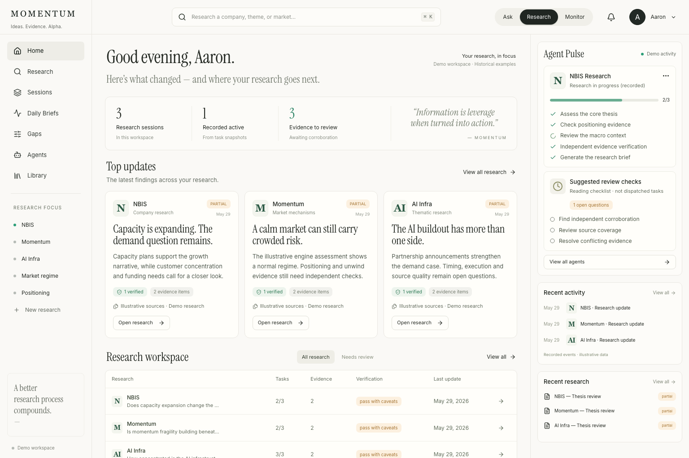
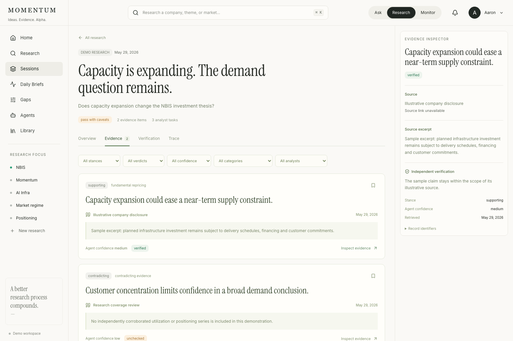

# Momentum Research Agent

Multi-agent investigation system for US equity momentum tail-risk. A coordinator decomposes a research question, runs independent analyst sub-agents in parallel, and synthesizes a structured PM brief.

This is an original, purpose-built orchestration layer. It sits on top of a deterministic momentum tail-risk engine (Daniel–Moskowitz risk state, FINRA/GDELT overlays, triggered evidence). `engine_query` runs `momentum-tail-risk-monitor` `run_mvp` via subprocess (`scripts/run_monitor.py`) when a monitor checkout or the vendored PIT pack is available. File snapshots and local DM cannot V_D pass. Labeled mock is fail-closed.

## Frontend showcase

The Momentum workspace brings research sessions, evidence, verification, and daily briefs into one interface. A three-column desktop layout pairs the research overview with an agent activity rail; session pages expose evidence and source details without losing context.

**Research dashboard**



<details>
<summary>Explore the evidence review interface</summary>

Filter claims by stance, verdict, confidence, category, or analyst, then inspect the supporting source and independent verification separately.



</details>

These implementation screenshots were captured in **Demo mode on September 8, 2026**. Research claims, verification badges, and activity are illustrative—not live market data or current agent status. Later Daily Brief and run-control additions are not pictured.

[Frontend setup and features](frontend/README.md) · [Mobile layout](frontend/qa/home-390.png) · [Design and visual QA](frontend/design-qa.md)

## Architecture

```
question
   │
   ▼
Coordinator (deepseek-flash)
   ├─ decompose → TaskBoard (disk)
   ├─ gap seed  → at most 2 kind=gap tasks from reports/gap_ledger.jsonl
   ├─ engine warm → subprocess run_mvp cache (~90s)
   ├─ dispatch  → bounded SubAgents in parallel (deepseek-flash, ReAct + allowlisted tools)
   │                └─ ResearchReport { findings: Evidence[], summary, status }
   ├─ replan    → at most one kind=replan (BLOCKED / mock / V_D fail)
   ├─ verify    → independent Verifier (static audit + ReAct re-check of Evidence[])
   ├─ append    → verification.gaps → reports/gap_ledger.jsonl (OPEN / CONSUMED / CLOSED)
   ├─ follow-up → at most one extra dispatch on rejected/unchecked evidence
   └─ synthesize → reports/{session}/synthesis.md
```

`ResearchReport.findings` is a list of typed `Evidence` objects (the machine-readable source of truth). `summary` is the human-readable view. No LangChain, LangGraph, or CrewAI.

## Setup

Requires Python 3.12+ and [uv](https://docs.astral.sh/uv/).

```bash
uv sync --group dev
cp .env.example .env
# set DEEPSEEK_API_KEY
# optionally SERPER_API_KEY or TAVILY_API_KEY for web_search
# optionally MOMENTUM_ENGINE_DIR pointing at momentum-tail-risk-monitor
```

## Usage

### Market/book daily brief (no LLM)

For a latest-data **personal ETF momentum proxy** (MTUM versus SPY, optional VIX):

```bash
uv run momentum-research-agent --daily-brief --brief-source etf-proxy
```

This fetches public data for the previous New York trading session, snapshots
the inputs, and computes returns, relative performance, drawdown and volatility.
No key or LLM is used. It is not the original engine or a crash-probability model.
See [ETF proxy usage, data checks and offline replay](docs/etf-proxy-brief.md).

Add optional issuer flows, concentration and cross-fund holdings overlap:

```bash
uv run momentum-research-agent --daily-brief --brief-source etf-proxy --with-crowding
```

This adds MTUM/QUAL/IVV issuer snapshots and partial crowding evidence, not a
crowding score. MTUM net creations require a compatible preceding-session brief
supplied with `--previous-brief`; the first run reports unavailable flows.
See [definitions, limitations and offline replay](docs/crowding-indicators.md).

For historical holdings, use `--backfill-crowding --as-of YYYY-MM-DD` and optionally
`--compare-brief <newer-brief.json>`. Exact-date issuer downloads are best effort;
`--issuer-files <import.json>` supports offline original-file imports when the
historical route is unavailable. See [historical data preparation](docs/historical-crowding.md).

For a **hypothetical fixed-basket** alternative (not historical holdings), run
`--simulate-basket --basket-brief <saved ETF brief.json> --start-date 2026-05-29`.
It applies that later MTUM basket's weights at the starting close, holds positions
without rebalancing, and compares cash-dividend returns and price-driven
concentration. Look-ahead bias is explicit. See [fixed-basket comparison](docs/fixed-basket.md).

The original **engine** workflow remains the default:

```bash
uv run momentum-research-agent --daily-brief --as-of 2026-05-29
# Optional: compare with an earlier compatible brief
uv run momentum-research-agent --daily-brief --as-of 2026-05-29 \
  --previous-brief reports/<earlier-run>/brief.json
```

This is a deterministic first release of an as-of brief, not a real-time market
feed or automated trading system. Supply the intended completed-session date
explicitly; the command never substitutes an older date. It checks processed
panel coverage before running the existing engine once (90s subprocess limit,
network disabled, no retries). No DeepSeek key or model requests are needed.
`MOMENTUM_ENGINE_DIR` selects an existing engine checkout; otherwise the existing
resolver prefers a sibling `momentum-tail-risk-monitor` checkout, then the bundled
historical engine. A missing configured engine does not silently fall back.

The new output directory contains `brief.md`, schema-versioned `brief.json`, and,
when produced, the original `assessment.json` plus the private `engine_run/`
artifact. Use `--session-dir <new-directory>` to choose its location; existing
directories are refused. The brief reports engine state, crowding/unwind scores,
missing metrics, panel dates/hashes, source-field references, and delivery checks.
Each score is a monitoring score, **not a crash probability**; a normal DM state
does not establish low overall risk. The engine's book is not your own portfolio.

- Exit **0 / partial**: an engine assessment is available, with explicit research
  limitations. Cached dates do not prove publication-time/PIT correctness or
  complete constituent coverage. The bundled universe also has a later vintage
  than some historical assessments; this is not a bias-free backtest.
- Exit **2 / unavailable**: required dates/files are missing, execution fails,
  delivery/score validation fails, or inputs change during execution. Metrics are
  withheld and a diagnostic brief is retained when the output location is writable.
- Comparison is opt-in, reads the earlier source artifact, validates its hash,
  and requires an earlier date in the same holdings month, the same engine code,
  score formula, holdings and universe hashes. Incompatible comparisons are
  withheld, not treated as zero change. Deltas describe engine output changes,
  not predictive performance or causal attribution.

The bundled panels cannot support a current daily feed. Refreshing the engine's
processed inputs and adding publication-time/coverage validation is the next
operational dependency. This command does not fetch data, schedule runs, invoke
free-form agents, or activate self-improvement policies. Existing research and
shadow-evaluation commands are unchanged.

```bash
uv run momentum-research-agent "Is the recent NVDA selloff a momentum crash signal or a healthy rotation?"

uv run momentum-research-agent --mode single "Analyze NVDA credit risk"

uv run momentum-research-agent --eval       # deterministic; no DeepSeek
uv run momentum-research-agent --improve    # at most one candidate
uv run momentum-research-agent --import-session reports/<session-id>  # offline

uv run momentum-research-agent --live-compare \
  --baseline-policy <version-id-or-policy.json> \
  --candidate-policy <version-id-or-policy.json> \
  --cases curated-cases.json \
  --expectations behavioral-expectations.json \
  --max-cases 2 --repeats 2 \
  --max-llm-calls 24 --max-output-tokens 1024 \
  --max-turns 3 --llm-timeout-s 40 --overall-deadline-s 90
```

`--eval` keeps the existing deterministic engine check and gap-ledger writeback. `--improve` runs a separate, pinned offline engine guard from the bundled fixture, evaluates recorded policy-contract checkpoints, and requests at most one schema-bound candidate only when the baseline has policy failures. `--import-session` reads existing structured session artifacts and creates pending cases without a model request or invented expected answer.

`--live-compare` is an explicit live-LLM shadow run over fixed, validated stored tool observations. Baseline and candidate receive the same cases, model request, temperature, budgets, and observations; only their immutable research policy differs. It defaults to two repeats. The CLI prints the enforced request and output-token ceilings before client creation, disables SDK retries, and records requested plus actual response model IDs. Missing cases, timeouts, unsupported calls, malformed/truncated reports, or different resolved models fail closed. It writes a self-contained `reports/live_evals/<run-id>/comparison.json` and does not change the active policy or gap ledger.

Expectations are reviewer-authored in a separate `behavioral_expectations_v1` JSON object. Each entry binds `case_id` and canonical `case_sha256`, labels the case `target` or `guard`, records reviewer/provenance/rationale, declares at least one exact tool call, and requires either observation-backed evidence or explicit claim withholding. This is bounded behavioral assertion coverage, not a general semantic truth or research-quality score. A cases JSON file may contain full `SessionEvalCase` objects or explicit case IDs already present under `reports/eval_cases/`.

The 2026-09-05 controller-owned synthetic wiring smoke used one target, one guard, one repeat, three turns, a 12-request cap, and 1,024 output tokens/request. All four policy/case runs completed in eight requests and resolved to `deepseek-v4.1-flash` (sent as `deepseek-flash`); the active pointer was unchanged. Both policies passed both toy cases, so the result demonstrated bounded replay/comparison wiring and observed guard non-regression, not historical performance or candidate improvement.

Flags: `--mode team|single`, `--session-dir`, `--resume`, `--max-sub-agents`, `--model`, `--coordinator-model`, `--verbose`, `--eval`, `--improve`, `--import-session`, `--live-compare`, plus the explicit live comparison input and bound flags shown above.

On startup the CLI prints a Rich banner, a decomposition table, live task-board updates during dispatch, a synthesis panel, a token/cost summary, and the session path.

## Session artifacts

Each run writes `reports/{YYYYMMDD}_{HHmmss}_{8-char-hex}/`, plus a cross-session `reports/gap_ledger.jsonl`:

| File | Purpose |
| --- | --- |
| `reports/gap_ledger.jsonl` | Cross-session OPEN/CONSUMED/CLOSED gap occurrences (deduped per evidence and source session) |
| `reports/eval_cases/*.json` | Pending imported session-failure occurrences; expectations remain separate |
| `reports/live_evals/{run-id}/comparison.json` | Paired behavioral shadow runs, policy/case/expectation snapshots, calls, reports, usage, latency, and outcome |
| `reports/prompt_evolution.json` | Runtime overlay rules from OPEN gaps (not weight training) |
| `reports/profile_hints.md` | Appended to frozen profiles at load time |
| `reports/policies/active.json` | Atomic pointer to the active immutable research-policy version |
| `reports/policies/versions/{version_id}.json` | Content-addressed baseline and promoted policy versions |
| `reports/policies/experiments/{experiment_id}.json` | Baseline, candidate, fixture fingerprints, and promotion decision for each attempted cycle |
| `policy_snapshot.json` | Per-session version pin; resumes reuse the policy loaded at session start |
| `task_board.json` | Full task history with timestamps |
| `sub_reports/{task_id}_{profile}.json` | Canonical `ResearchReport` (Evidence[]) |
| `sub_reports/{task_id}_{profile}.md` | Human-readable rendering of the same report |
| `traces.jsonl` | Append-only `engine_query` / `web_search` replay log |
| `verification.json` / `verification.md` | Per-session momentum gap ledger: `gaps[]` + replayable `traces[]` + verdicts |
| `synthesis.md` / `synthesis.json` | Final PM brief |

`--resume` reloads JSON reports first. Markdown-only leftovers from older sessions become a low-confidence compatibility report.

Policy is non-authoritative guidance. It may affect only research prompt overlays, gap-task additions, and selection among tools already authorized for a research profile. It cannot add tools or profiles, change deterministic signals, or guide the verifier. Committed profile Markdown stays frozen, and the verifier never loads policy overlays. A research session snapshots the active version once at startup; an improvement completed during that session does not change the running or resumed session.

To roll back, choose a known prior ID from `reports/policies/versions/` and use the validating store helper, which refuses missing or corrupt versions:

```bash
PYTHONPATH=src python -c 'from pathlib import Path; from momentum_research_agent.state.policies import PolicyStore; PolicyStore(Path.cwd()).activate("<prior-version-id>")'
```

`--improve` uses `reports/policies/improvement.lock` to prevent overlapping cycles. If an interrupted process leaves it behind, first confirm that no improvement process is running; only then remove that single stale lock file and retry.

## Runtime bounds

Each sub-agent is capped by `LoopBudget`: 8 ReAct turns, 45s overall deadline, 20s per LLM call, 10s per tool. Cancellation (`asyncio.CancelledError`) propagates. Unknown analyst profiles and off-allowlist tools fail closed. `shell` is not part of normal research capabilities.

After verification, the coordinator may dispatch at most one extra follow-up round (default 2 tasks) for `rejected` / `unchecked` evidence, then re-verify once. Verified items are not reopened. `--mode single` does not follow up. After the first dispatch wave, at most one `kind=replan` may run for BLOCKED tasks or a labeled-mock / V_D-fail `engine_query`. File snapshot and local_dm do not replan. That is not a second follow-up. `engine_query` without `end` resolves the latest known as-of and still runs the live pipeline.

The next session may plant at most 2 `kind=gap` tasks from `reports/gap_ledger.jsonl` after decompose (`crowding` → `flow_analyst`, unwind/engine → `momentum_analyst`). After that session verifies the planted tasks, rows become `CLOSED` or go back to `OPEN`. That is not a second follow-up.

## Tools

| Tool | Behavior |
| --- | --- |
| `web_search` | Serper, then Tavily. Clear error if neither key is set. |
| `file_reader` | `.md` `.txt` `.csv` (first 100 rows) `.json`. Refuses paths outside the project. |
| `engine_query` | Subprocess `scripts/run_monitor.py` → `run_mvp` (V_D pass only when `pipeline_run=true`). File snapshots / local DM cannot pass. Labeled mock if the pipeline cannot run. |
| `market_data` | yfinance OHLCV table (period default `3mo`). |
| `shell` | Implemented but **not** assigned to research profiles. Not used in normal flows. |

## Models and cost

Client initialization is always:

```python
client = AsyncOpenAI(
    api_key=os.environ["DEEPSEEK_API_KEY"],
    base_url="https://api.deepseek.com",
)
```

Sub-agents and coordinator default to `deepseek-flash`, the official API ID for
[DeepSeek V4.1 Flash](https://www.deepseek.com/en/news/deepseek-v4-1-flash/).

```bash
SUB_AGENT_MODEL=deepseek-flash
COORDINATOR_MODEL=deepseek-flash
```

Cost estimates use published USD / 1M-token rates (cache-hit and peak/off-peak ignored):

| Model | Input | Output |
| --- | ---: | ---: |
| deepseek-chat | $0.27 | $1.10 |
| deepseek-reasoner | $0.55 | $2.19 |
| deepseek-flash | $0.22 | $0.66 |
| deepseek-v4-pro | $0.66 | $1.98 |

See [DeepSeek pricing](https://api-docs.deepseek.com/quick_start/pricing).

## Five-question daily market research

```bash
uv run momentum-research-agent --daily-brief --brief-source etf-proxy \
  --with-market-research --reference-date 2026-05-29
```

Writes `market_brief.md/json` answering momentum, concentration, short interest,
volatility and whether the evidence supports a crowding conclusion. Adds official
FINRA positions with publication-aware dates and complete-coverage fixed-basket
DTC. Optional DeepSeek prioritization is one bounded call over verified answer
IDs; `--no-brief-llm` needs no key. Original engine/proxy modes are unchanged.
See [methodology, offline replay and daily workflow](docs/market-research-brief.md).
No automatic scheduler or policy promotion is added.

After the brief is saved, a material price/volatility alert or newly lost evidence
can trigger one bounded analyst + verifier supplement (at most five extra model
requests, once per target date). `--no-brief-research` skips it;
`--no-brief-llm` disables both model stages. Failures enter the existing gap ledger
for separately curated improvement, without blocking or rewriting the brief.

`web_search` can use DeepSeek's native Messages search with the same key, without
Tavily/Serper. Set `MOMENTUM_ENV_FILE` to your existing local `.env`; the
`DeepSeekAPI` alias is accepted. [Native-search setup, evidence and limits](docs/native-search.md).

## Tests

```bash
uv run pytest
```

## Layout

See `AGENTS.md` for how to add tools, profiles, and prompts without touching orchestration code.

An example compiled ledger (engine snapshot + search observation + open gaps) lives in `examples/nvda_momentum_gap_ledger.json`.

## Research workspace

The optional [frontend workspace](frontend/README.md) provides a read-only artifact reader, browser-only Demo scenarios, and a separate opt-in local execution service. The Runs page supports confirmed research requests and 08:00 Toronto Daily Brief scheduling through the existing CLI. Sync and builds remain read-only; only the execution service launches backend writes. See its README for startup, safety boundaries, and private build modes.
